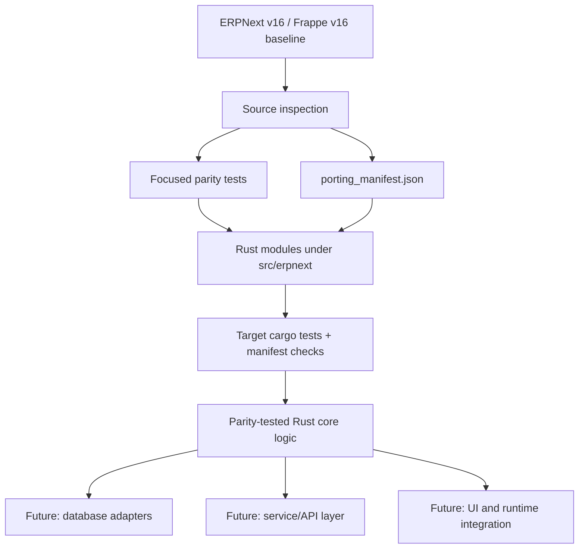

# Tokio ERP

Tokio ERP is an independent GPLv3 Rust rewrite of ERPNext-compatible core logic.

The project is parity-first: ERPNext v16 Python modules are inspected, modeled in Rust, covered with focused tests, and tracked in a source-to-target manifest before broader database, API, and UI integration is built.

Tokio ERP is not production-ready.

## Why This Exists

ERP systems are usually large, dynamic, and hard to reason about. Tokio ERP explores a Rust-first implementation path for ERPNext-compatible business logic with:

- explicit data models instead of implicit runtime document state,
- focused parity tests for formulas, filters, report shapes, and edge cases,
- source-path mirroring so every port can be traced back to the ERPNext baseline,
- a conservative GPLv3 publication model with clear attribution and trademark boundaries.

## Architecture



Current code is organized to mirror upstream ERPNext paths. For example, a Python source such as:

```text
erpnext/accounts/doctype/pos_profile/pos_profile.py
```

maps to:

```text
src/erpnext/accounts/doctype/pos_profile/pos_profile.rs
tests/accounts_pos_profile.rs
```

## Current Status

Tokio ERP is under active development.

Completed ports currently model ERPNext behavior with Rust structs, deterministic helper APIs, in-memory execution, and parity tests. Direct Frappe runtime integration, MariaDB/MySQL persistence, web UI, deployment flows, and production operations are later phases.

The canonical port tracker is:

```text
porting_manifest.json
```

Entries marked `parity_tested` have targeted Rust tests for the ported behavior.

## Baseline

The current rewrite baseline is:

- Frappe: `version-16` at `69be97cf314e53e314678c5af98fef25f5c2d7e6`
- ERPNext: `version-16` at `6ef4a2d82cfe3815a8bd491436256df3e4ed79b8`

## Repository Layout

```text
src/erpnext/              Rust modules organized to mirror ERPNext source paths
tests/                    Focused parity tests
docs/                     Port maps and rewrite notes
porting_manifest.json     Source-to-target porting manifest
tools/                    Local helper tooling
LICENSE                   GPL-3.0-only license
NOTICE.md                 Attribution and baseline notices
TRADEMARKS.md             Trademark and affiliation notice
```

## Development

Agents continuing the rewrite should read [AI_HANDOFF.md](AI_HANDOFF.md) before making changes.

Run a focused test while working on one module:

```bash
cargo test --test accounts_pos_profile
```

Run manifest checks:

```bash
cargo test --test porting_manifest
```

Run compile checks:

```bash
cargo check
```

Check whitespace before committing:

```bash
git diff --check
git diff --cached --check
```

Run the full suite at larger review checkpoints:

```bash
cargo test
```

## Porting Discipline

The project follows a strict parity workflow:

1. Inspect the ERPNext source file first.
2. Write a focused Rust test that captures the Python behavior.
3. Confirm the test fails before implementation.
4. Implement the Rust logic with the smallest matching surface.
5. Run the target test and manifest test.
6. Mark the manifest entry `parity_tested`.
7. Commit the completed batch.

The goal is not a loosely inspired ERP. The goal is traceable, test-backed behavioral parity where a module has been ported.

## Legal And Trademark Notice

Tokio ERP is licensed under the GNU General Public License v3.0 only. See [LICENSE](LICENSE).

ERPNext is licensed under the GNU General Public License v3.0. Portions of Tokio ERP are derived from, ported from, or designed for behavioral compatibility with ERPNext. See [NOTICE.md](NOTICE.md).

Tokio ERP is not affiliated with, endorsed by, sponsored by, or approved by Frappe Technologies Pvt. Ltd.

ERPNext and Frappe are trademarks of Frappe Technologies Pvt. Ltd. Their names are used in this repository only for attribution, source-reference, and compatibility description. See [TRADEMARKS.md](TRADEMARKS.md).

## Public Use

If you redistribute Tokio ERP or modified versions of it, comply with GPLv3 requirements, including preserving notices and providing corresponding source code.

Do not use ERPNext or Frappe names or logos as part of Tokio ERP branding, product names, service names, domains, advertising, or logos unless you have permission from the trademark owner.
